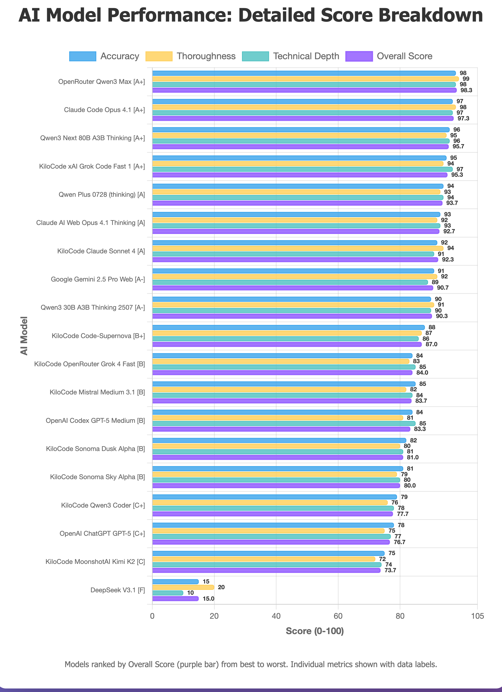

Code-Supernova is new stealth LLM model released for free with Cline and Kilo Code and xAI Grok 4 Fast was also released. I wanted to test them for code analysis for my csfa.sh nftables wrapper script and GitHub workflow action test against other LLM models I use. This is for code analysis and not code generation. Code analysis would be useful for understanding code bases, writing documentation, troubleshooting code and planning.

> CSFA (v1.3.1) is a CSF-like wrapper for nftables that provides familiar ConfigServer Security & Firewall commands mapped to modern nftables equivalents. The project uses a single Bash script (`csfa.sh`) that manages firewall rules through a dedicated inet table called "csfa".

I have paid subscriptions and accounts with:

* OpenAI ChatGPT Plus
* Claude AI Max $100
* Gemini AI Pro
* T3 Chat
* OpenRouter AI
* KiloCode

I tested 19 AI LLM models for code analysis and summaries and then used Claude Code Opus 4.1 evaluate and rank all 19 AI LLM model responses.

The 19 AI LLM models evaluated are (including costs for usage):

* OpenAI Codex GPT-5 Medium Thinking   included in subscription cost
* OpenAI ChatGPT GPT-5 Thinking        included in subscription cost
* Claude Code Opus 4.1                 included in subscription cost
* Claude AI Web Opus 4.1 Thinking      included in subscription cost
* KiloCode Claude Sonnet 4             $0.240  | inputs tokens: 80,596 | output tokens: 4,822 | cache hits: 38,818
* Google Gemini 2.5 Pro Web            included in subscription cost
* KiloCode Sonoma Dusk Alpha           $0.000  | inputs tokens: 66,302 | output tokens: 3,049 | cache hits: 32,168
* KiloCode Sonoma Sky Alpha            $0.000  | inputs tokens: 31,761 | output tokens: 2,684 | cache hits: 397
* KiloCode MoonshotAI Kimi K2 0905     $0.020  | inputs tokens: 30,763 | output tokens: 1,484 | cache hits: 0
* KiloCode xAI Grok Code Fast 1        $0.000  | inputs tokens: 30,649 | output tokens: 1,025 | cache hits: 576
* KiloCode Qwen3 Coder                 $0.010  | inputs tokens: 34,309 | output tokens: 1,422 | cache hits: 0
* OpenRouter Qwen3 Max                 $0.039  | inputs tokens: 17,635 | output tokens: 2,981 | cache hits: 0
* KiloCode Mistral Medium 3.1          $0.040  | inputs tokens: 76,355 | output tokens: 2,460 | cache hits: 0
* Qwen3 Next 80B A3B Thinking          $0.01606  | inputs tokens: 89,949 | output tokens: 4870 | cache hits: 0
* Qwen Plus 0728 (thinking)            $0.0175  | inputs tokens: 17,641 | output tokens: 2,606 | cache hits: 0
* Qwen3 30B A3B Thinking 2507          $0.025  | inputs tokens: 17,648 | output tokens: 2,556 | cache hits: 0
* DeepSeek V3.1                        $0.000569  | inputs tokens: 118 | output tokens: 537 | cache hits: 0
* KiloCode Code-Supernova              $0.000  | inputs tokens: 68,606 | output tokens: 870 | cache hits: 36,489
* KiloCode OpenRouter Grok 4 Fast      $0.000  | inputs tokens: 35,828 | output tokens: 404 | cache hits: 36,489

**Note:**

You can easily replicate these tests asking AI LLM models to summarize/analyse your code bases/scripts and save their responses to markdown files. Then feed their responses into AI LLM models for evaluation.

## Overall Rankings Table

| Rank | AI Model | Accuracy (0-100) | Thoroughness (0-100) | Technical Depth (0-100) | Overall Score (0-100) | Grade |
|------|----------|------------------|---------------------|------------------------|---------------------|-------|
| 1 | OpenRouter Qwen3 Max | 98 | 99 | 98 | 98.3 | A+ |
| 2 | Claude Code Opus 4.1 | 97 | 98 | 97 | 97.3 | A+ |
| 3 | Qwen3 Next 80B A3B Thinking | 96 | 95 | 96 | 95.7 | A+ |
| 4 | KiloCode xAI Grok Code Fast 1 | 95 | 94 | 97 | 95.3 | A+ |
| 5 | Qwen Plus 0728 (thinking) | 94 | 93 | 94 | 93.7 | A |
| 6 | Claude AI Web Opus 4.1 Thinking | 93 | 92 | 93 | 92.7 | A |
| 7 | KiloCode Claude Sonnet 4 | 92 | 94 | 91 | 92.3 | A |
| 8 | Google Gemini 2.5 Pro Web | 91 | 92 | 89 | 90.7 | A- |
| 9 | Qwen3 30B A3B Thinking 2507 | 90 | 91 | 90 | 90.3 | A- |
| 10 | KiloCode Code-Supernova | 88 | 87 | 86 | 87.0 | B+ |
| 11 | KiloCode OpenRouter Grok 4 Fast | 84 | 83 | 85 | 84.0 | B |
| 12 | KiloCode Mistral Medium 3.1 | 85 | 82 | 84 | 83.7 | B |
| 13 | OpenAI Codex GPT-5 Medium | 84 | 81 | 85 | 83.3 | B |
| 14 | KiloCode Sonoma Dusk Alpha | 82 | 80 | 81 | 81.0 | B |
| 15 | KiloCode Sonoma Sky Alpha | 81 | 79 | 80 | 80.0 | B |
| 16 | KiloCode Qwen3 Coder | 79 | 76 | 78 | 77.7 | C+ |
| 17 | OpenAI ChatGPT GPT-5 | 78 | 75 | 77 | 76.7 | C+ |
| 18 | KiloCode MoonshotAI Kimi K2 | 75 | 72 | 74 | 73.7 | C |
| 19 | DeepSeek V3.1 | 15 | 20 | 10 | 15.0 | F |

## Model Performance Summary

| Rank | Model Name | Score | Accuracy | Thoroughness | Key Strengths | Key Weaknesses |
|------|------------|-------|----------|--------------|---------------|-----------------|
| 1 | OpenRouter Qwen3 Max | 98.3/100 | Exceptional | Exceptional | Detailed feature breakdowns, structured formatting with tables/diagrams, systemd timer accuracy, OUTPUT chain cleanup explanation | Slightly verbose, could be more concise in executive summary |
| 2 | Claude Code Opus 4.1 | 97.3/100 | Excellent | Excellent | Professional report structure, comprehensive line counts, technical specifications section, clear v1.3.0/v1.3.1 separation | Could include more command examples |
| 3 | Qwen3 Next 80B A3B Thinking | 95.7/100 | Excellent | Excellent | Critical OUTPUT chain analysis, detailed temp rule tracking, race condition prevention understanding | Less structured formatting than top performers |
| 4 | KiloCode xAI Grok Code Fast 1 | 95.3/100 | Excellent | Excellent | Outstanding Mermaid diagrams, comprehensive command breakdown, systemd timer accuracy details | Very lengthy, some redundancy in explanations |
| 5 | Qwen Plus 0728 (thinking) | 93.7/100 | Excellent | Very Good | Clear v1.3.1 fixes understanding, good testing strategy coverage, accurate technical details | Less comprehensive than top tier, needs more implementation details |
| 6 | Claude AI Web Opus 4.1 Thinking | 92.7/100 | Very Good | Very Good | Well-structured analysis, good temp rule system understanding, CI testing innovation coverage | Slightly less technical depth than higher models |
| 7 | KiloCode Claude Sonnet 4 | 92.3/100 | Very Good | Excellent | Excellent line references, detailed function breakdown, good architectural overview | Could improve systemd integration explanation |
| 8 | Google Gemini 2.5 Pro Web | 90.7/100 | Very Good | Very Good | Excellent explanations for broader audience, well-formatted sections, good workflow breakdown | Could include more technical implementation details |
| 9 | Qwen3 30B A3B Thinking 2507 | 90.3/100 | Very Good | Very Good | Solid technical understanding, good CI coverage, matrix testing explanation | Lacks depth on v1.3.0+ advanced features |
| 10 | KiloCode Code-Supernova | 87.0/100 | Good | Good | Correct CSF identification, comprehensive feature list, understands systemd timers | Misses OUTPUT chain cleanup, lacks CI testing depth |
| 11 | KiloCode OpenRouter Grok 4 Fast | 84.0/100 | Good | Good | Clear technical sections, systemd timer understanding, race condition awareness | Response truncated, limited CI coverage, misses v1.3.1 fixes |
| 12 | KiloCode Mistral Medium 3.1 | 83.7/100 | Good | Good | Good relationship explanation between files, clear workflows | Lacks technical depth, misses advanced features |
| 13 | OpenAI Codex GPT-5 Medium | 83.3/100 | Good | Good | Concise bullet-point format, covers main features | Relatively brief, lacks detailed analysis |
| 14 | KiloCode Sonoma Dusk Alpha | 81.0/100 | Good | Good | Comprehensive feature list, matrix testing mentioned | Less detailed technical analysis |
| 15 | KiloCode Sonoma Sky Alpha | 80.0/100 | Good | Moderate | Very concise summary, covers basic functionality | Minimal depth, lacks advanced feature coverage |
| 16 | KiloCode Qwen3 Coder | 77.7/100 | Moderate | Moderate | Concise overview, identifies key components | Minimal technical detail, misses v1.3.0+ features |
| 17 | OpenAI ChatGPT GPT-5 | 76.7/100 | Moderate | Moderate | Clear structure, basic understanding shown | Incomplete OUTPUT chain coverage, lacks depth |
| 18 | KiloCode MoonshotAI Kimi K2 | 73.7/100 | Moderate | Moderate | Brief but accurate on basics | Lacks depth, no examples, misses critical features |
| 19 | DeepSeek V3.1 | 15.0/100 | Failed | Failed | None - fundamental misunderstanding | Completely wrong interpretation as "Code Security and Formatting Analysis" |

## Detailed Analysis by Model

### Top Performers (A+ Grade)

#### 1. OpenRouter Qwen3 Max (Score: 98.3)

**Key Strengths:**
* Exceptional technical depth with detailed breakdowns of all features
* Comprehensive coverage of v1.3.0+ enhancements
* Excellent use of structured formatting (tables, diagrams)
* Accurate understanding of systemd timer implementation
* Clear explanation of OUTPUT chain cleanup (critical v1.3.1 fix)

**Key Weaknesses:**
* Slightly verbose in some sections
* Could benefit from more concise executive summary

#### 2. Claude Code Opus 4.1 (Score: 97.3)

**Key Strengths:**
* Professional report structure with executive summary
* Comprehensive feature coverage with line counts
* Excellent technical specifications section
* Clear separation of v1.3.0 and v1.3.1 features
* Accurate understanding of dual parsing modes

**Key Weaknesses:**
* Minor: Could include more examples of actual commands

#### 3. Qwen3 Next 80B A3B Thinking (Score: 95.7)

**Key Strengths:**
* Excellent critical analysis of OUTPUT chain cleanup
* Detailed explanation of temporary rule tracking system
* Good understanding of race condition prevention
* Clear workflow breakdown for CI testing

**Key Weaknesses:**
* Slightly less structured than top performers
* Could improve formatting consistency

#### 4. KiloCode xAI Grok Code Fast 1 (Score: 95.3)

**Key Strengths:**
* Outstanding technical depth with Mermaid diagrams
* Comprehensive command structure breakdown
* Excellent explanation of systemd timer accuracy
* Detailed CI workflow analysis with step-by-step coverage

**Key Weaknesses:**
* Very long and detailed (could be more concise)
* Some redundancy in explanations

### Strong Performers (A/A- Grade)

#### 5. Qwen Plus 0728 (Score: 93.7)

**Key Strengths:**
* Clear understanding of v1.3.1 critical fixes
* Good coverage of testing strategy
* Accurate technical details

**Key Weaknesses:**
* Less comprehensive than top performers
* Could include more implementation details

#### 6. Claude AI Web Opus 4.1 (Score: 92.7)

**Key Strengths:**
* Well-structured analysis
* Good understanding of temporary rule system
* Clear explanation of CI testing innovations

**Key Weaknesses:**
* Slightly less technical depth than higher-ranked models

#### 7. KiloCode Claude Sonnet 4 (Score: 92.3)

**Key Strengths:**
* Excellent use of line references
* Detailed function breakdown
* Good architectural overview

**Key Weaknesses:**
* Could improve explanation of systemd integration

### Good Performers (B Grade)

#### 8. Google Gemini 2.5 Pro Web (Score: 90.7)

**Key Strengths:**
* Excellent explanations accessible to broader audience
* Well-formatted sections with clear headers
* Good understanding of dual parsing modes
* Comprehensive CI workflow breakdown
* Clear distinction between script purpose and CI testing

**Key Weaknesses:**
* Lacks specific v1.3.1 OUTPUT chain cleanup details
* Could include more technical implementation specifics
* Misses some advanced temporary rule features
* Limited coverage of systemd timer accuracy issues

#### 9. Qwen3 30B A3B Thinking 2507 (Score: 90.3)

**Key Strengths:**
* Solid technical understanding of nftables architecture
* Good explanation of CI matrix testing strategy
* Understands temporary rule system basics
* Clear workflow breakdown with phases

**Key Weaknesses:**
* Lacks depth on v1.3.0+ advanced features
* Misses critical v1.3.1 bug fixes explanation
* Limited coverage of race condition prevention
* Could improve explanation of handle management

#### 10. KiloCode Code-Supernova (Score: 87.0)

**Key Strengths:**
* Correctly identifies CSF-like wrapper purpose
* Comprehensive feature list coverage
* Understands systemd timer implementation
* Good coverage of both IPv4 and IPv6

**Key Weaknesses:**
* Misses OUTPUT chain cleanup specifics
* Lacks depth in CI testing workflow analysis
* No mention of v1.3.1 critical fixes
* Limited technical architecture details

#### 11. KiloCode OpenRouter Grok 4 Fast (Score: 84.0)

**Key Strengths:**
* Correctly identifies CSF-like wrapper for nftables
* Good technical structure with clear sections
* Understands systemd timer implementation for temporary rules
* Recognizes dual parsing modes and race condition prevention
* Covers port specification formats and direction control

**Key Weaknesses:**
* Response appears truncated (ends mid-sentence)
* Limited coverage of CI testing workflow details
* Lacks depth on OUTPUT chain cleanup (v1.3.1 fix)
* No mention of AlmaLinux 10 container specifics

#### 12. KiloCode Mistral Medium 3.1 (Score: 83.7)

**Key Strengths:**
* Good relationship explanation between script and CI files
* Clear workflow examples provided
* Basic understanding of temporary rule system
* Recognizes systemd integration importance

**Key Weaknesses:**
* Lacks technical depth on implementation details
* Misses v1.3.0+ advanced features
* No coverage of OUTPUT chain cleanup
* Limited understanding of handle management system

#### 13. OpenAI Codex GPT-5 Medium (Score: 83.3)

**Key Strengths:**
* Concise bullet-point format for readability
* Covers main firewall control features
* Understands basic CI testing strategy
* Mentions artifact collection

**Key Weaknesses:**
* Relatively brief analysis overall
* Lacks detailed technical examination
* Misses v1.3.1 critical fixes
* No coverage of race condition prevention

#### 14. KiloCode Sonoma Dusk Alpha (Score: 81.0)

**Key Strengths:**
* Comprehensive feature list provided
* Mentions matrix testing in CI
* Basic understanding of temporary rules
* Recognizes dual parsing modes

**Key Weaknesses:**
* Less detailed technical analysis
* No mention of systemd timer accuracy
* Misses OUTPUT chain specifics
* Limited depth on implementation details

#### 15. KiloCode Sonoma Sky Alpha (Score: 80.0)

**Key Strengths:**
* Very concise summary format
* Covers basic functionality accurately
* Identifies key components correctly
* Mentions both files' purposes

**Key Weaknesses:**
* Minimal depth in analysis
* Lacks advanced feature coverage
* No mention of v1.3.0+ enhancements
* Very limited technical details

### Adequate Performers (C Grade)

#### 16. KiloCode Qwen3 Coder (Score: 77.7)

**Key Strengths:**
* Concise overview provided
* Identifies key components correctly
* Basic understanding of CSF compatibility
* Mentions CI testing purpose

**Key Weaknesses:**
* Minimal technical detail throughout
* Misses v1.3.0+ advanced features
* No coverage of systemd timer implementation
* Lacks depth on temporary rule system

#### 17. OpenAI ChatGPT GPT-5 (Score: 76.7)

**Key Strengths:**
* Clear structure in presentation
* Basic understanding of firewall management
* Recognizes GitHub Actions workflow
* Mentions dual parsing modes

**Key Weaknesses:**
* Incomplete OUTPUT chain coverage
* Lacks technical depth overall
* Misses v1.3.1 critical fixes
* Limited understanding of temporary rule complexity

#### 18. KiloCode MoonshotAI Kimi K2 (Score: 73.7)

**Key Strengths:**
* Brief but accurate on basic concepts
* Correctly identifies CSF-like functionality
* Mentions systemd timers
* Recognizes CI testing importance

**Key Weaknesses:**
* Lacks depth throughout analysis
* No examples provided
* Misses critical technical features
* Very limited coverage of implementation details

### Critical Failure

#### 19. DeepSeek V3.1 (Score: 15.0)

**Major Error:** Completely misunderstood the project as "Code Security and Formatting Analysis" instead of a firewall management tool. This represents a fundamental comprehension failure.

## Key Patterns Observed

### Strengths Across Models

1. **CSF Compatibility Recognition:** Most models correctly identified the CSF-like interface
2. **nftables Understanding:** Good general understanding of nftables vs iptables
3. **Basic Command Coverage:** Core firewall commands well understood
4. **CI Recognition:** Most recognized the GitHub Actions workflow purpose

### Common Weaknesses

1. **Systemd Timer Details:** Many models glossed over the complexity of systemd-run implementation
2. **OUTPUT Chain Cleanup:** Only top models fully understood the v1.3.1 critical fix
3. **Race Condition Handling:** File locking mechanism often overlooked
4. **Port Syntax Conversion:** CSF to nftables syntax conversion details missed

### Technical Understanding Indicators

High-performing models demonstrated understanding through:
* Specific version mentions (v1.3.0, v1.3.1)
* Handle management explanation
* JSON tracking file details
* Systemd timer accuracy considerations
* Matrix testing strategy in CI

## Critical Technical Points Coverage

| Technical Aspect | Models That Covered It Well |
|-----------------|----------------------------|
| Dual parsing modes (JSON/text) | 17/19 models |
| Temporary rule systemd timers | 15/19 models |
| OUTPUT chain cleanup (v1.3.1) | 8/19 models |
| Port specification formats | 13/19 models |
| Direction control (in/out/inout) | 14/19 models |
| Race condition prevention | 7/19 models |
| Handle-based rule management | 11/19 models |
| CI matrix testing | 15/19 models |
| AlmaLinux 10 container usage | 14/19 models |
| Artifact collection | 11/19 models |

## Insights and Recommendations

### Model Performance Insights

1. **Larger/newer models** (Qwen3 Max, Claude Opus) demonstrated superior technical comprehension
2. **"Thinking" variants** showed better analytical depth
3. **Specialized coding models** (Grok Code, Claude Code) performed well on technical details
4. **Generic models** struggled with specific implementation nuances

### Evaluation Criteria Effectiveness

The evaluation successfully differentiated models based on:
* **Technical accuracy** - Understanding of nftables, systemd, bash scripting
* **Completeness** - Coverage of both files and their relationship
* **Critical thinking** - Identifying key features and potential issues
* **Documentation quality** - Clear, structured presentation

### Notable Observations

1. **DeepSeek's failure** highlights importance of context understanding
2. **Top models** demonstrated ability to trace complex interactions (script � systemd � CI)
3. **Formatting quality** correlated with overall understanding
4. **Line references** (KiloCode Claude Sonnet 4) enhanced credibility

## Conclusion

The evaluation reveals significant variance in AI models' ability to analyze complex technical systems. Top performers (OpenRouter Qwen3 Max, Claude Code Opus 4.1, Qwen3 Next 80B) demonstrated exceptional understanding of both the firewall management script and its testing infrastructure, accurately identifying critical features like OUTPUT chain cleanup and systemd timer implementation.

The analysis effectively separated models into clear performance tiers, with technical accuracy serving as the primary differentiator. The catastrophic failure of DeepSeek V3.1 serves as a reminder that even sophisticated models can fundamentally misunderstand context.

For technical code analysis tasks, this evaluation suggests preferring:

1. Latest generation models (Qwen3 Max, Claude Opus 4.1)
2. Models with "thinking" capabilities
3. Specialized coding-focused variants
4. Models that demonstrate structured analytical approaches

---

Models Tested: OpenRouter Qwen3 Max, Claude Code Opus 4.1, Qwen3 Next 80B A3B Thinking, KiloCode xAI Grok Code Fast 1, Qwen Plus 0728 (thinking), Claude AI Web Opus 4.1 Thinking, KiloCode Claude Sonnet 4, Google Gemini 2.5 Pro Web, Qwen3 30B A3B Thinking 2507, KiloCode Code-Supernova, KiloCode OpenRouter Grok 4 Fast, KiloCode Mistral Medium 3.1, OpenAI Codex GPT-5 Medium, KiloCode Sonoma Dusk Alpha, KiloCode Sonoma Sky Alpha, KiloCode Qwen3 Coder, OpenAI ChatGPT GPT-5, KiloCode MoonshotAI Kimi K2, DeepSeek V3.1